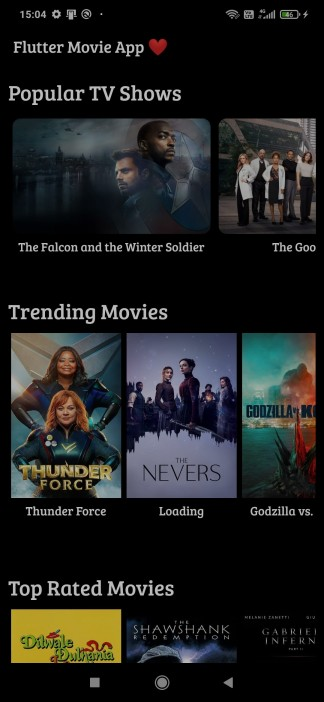

**I used flutter and the tmdb api to create this app.
 
The tmdb api retrieves real-time data and presents details about each movie, including a brief summary and rating.
 
It also provides information about the most popular television shows, movies, and other recently released films.**

Output - 

